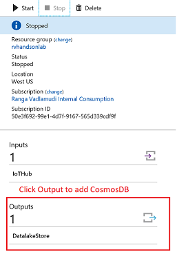
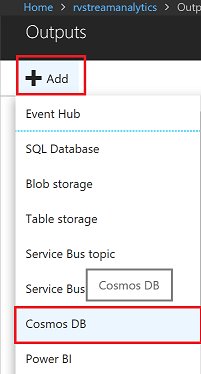
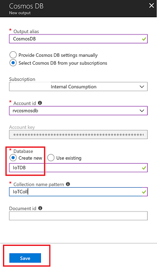
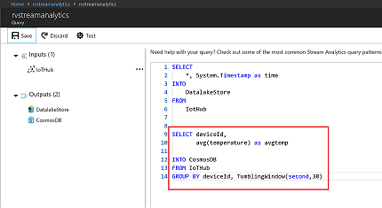
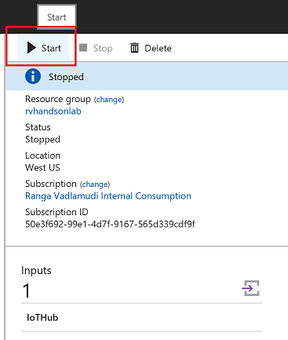
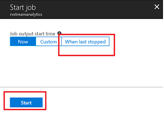
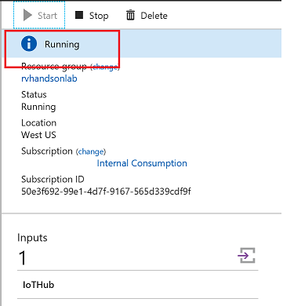
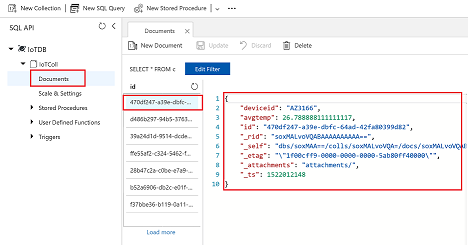

# Hot Path Analytics with CosmosDB and Azure Stream Analytics


Azure Cosmos DB is Microsoft's globally distributed, multi-model database. The atom-record-sequence (ARS) based data model that Azure Cosmos DB is built on natively supports multiple data models, including but not limited to document, graph, key-value, table, and column-family data models


Elastically and independently scale throughput and storage on demand and worldwide

Azure Cosmos DB provides five consistency levels: strong, bounded-staleness, session, consistent prefix, and eventual. 

In this lab you will learn

* streaming analytics with windowing techniques
* to Store Time Series Data in CosmosDB

## Stop Stream Analytics

To Add Cosmos DB as output to Stream Analytics Job you will need to Stop the job, Add Cosmos DB output and corresponding Query and Start the job


## Stream Data To Cosmos DB



Add Cosmos DB as an Output to Stream Analytics Job



Select Cosmos DB as an output. Also make sure you create a new Database and a collection if its is not already created



Edit existing query to Add new query to consume data from IoTHub and store data into Cosmos DB 

```sql
SELECT
    *, System.Timestamp as time
INTO
    CosmosDB
FROM
    IotHub
GROUP BY deviceId, TumblingWindow(second,30)
```



Start Stream Analytics Job



Make sure you stream all the data from when you last stopped the job. Stream Analytics interface provides an option



Make sure Stream Analytics job goes into running mode



Use Cosmos DB data explorer to view data being streamed from IoTHub to Cosmos DB


