# Cold Path Storage

## Create Data Lake Store and Stream Data from IoTHub using Azure Stream Analytics

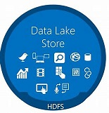

Azure Data Lake Store is an enterprise-wide hyper-scale repository for big data analytic workloads. Azure Data Lake enables you to capture data of any size, type, and ingestion speed in one single place for operational and exploratory analytics. Data Lake Store can store trillions of files. A single file can be larger than one petabyte in size. This makes Data Lake Store ideal for storing any type of data including massive datasets like high-resolution video, genomic and seismic datasets, medical data, and data from a wide variety of industries.


## Explore Data in Data Lake Store


### Create Folders in Data Lake Store

Create /workshop/streaming folder to store Streaming data coming from your device through IoTHub using Stream Analytics Job

Create /workshop folder


Create /workshop/streaming folder

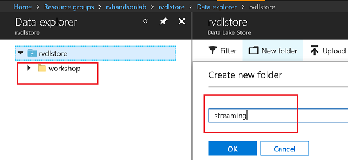

You should have the folder structure below in place to start streaming data to data lake store


Add Input for Streaming Job

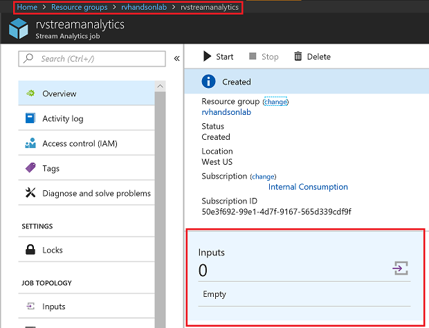

Select IoTHub as Input

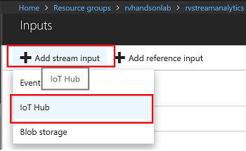

Make sure to provide a consumer group. Each consumer group allows up to 5 output sinks/consumers. Make sure you create a new consumer group for every 5 output sinks and you can create up to 32 consumer groups.

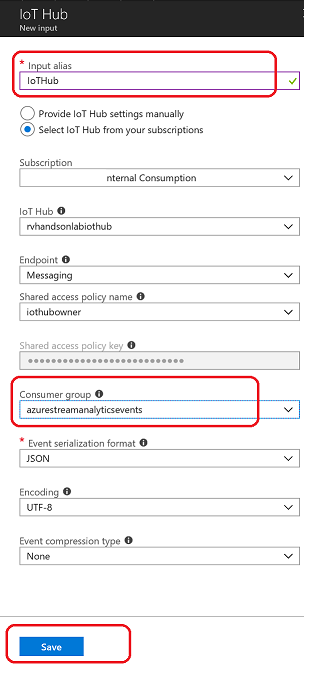

Add Data Lake Store as Output for Streaming Job

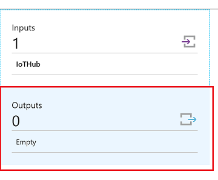

Select Data Lake Store as output sink

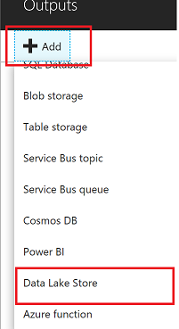

Select the Data Lake Store account you created in previous steps and provide folder structure to stream data to the store

/workshop/streaming/{date}/{time} with Date=YYYY/MM/DD format and Time=HH format will equate to /workshop/streaming/2018/03/30/11 on the store

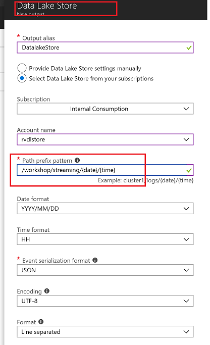

You will have to Authorize data lake store connection for Stream analytics to have access to be able to write to data lake store

1. Multi-factor authentication based on OAuth2.0
2. Integration with on-premises AD for federated authentication
3. Role-based access control
4. Privileged account management
5. Application usage monitoring and rich auditing
6. Security monitoring and alerting
7. Fine-grained ACLs for AD identities

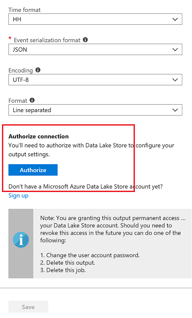

You will see a popup and once the popup closes Authorize button will be greyed out after azuthorization is complete. There are exception cases where popup doesnt appear.In this case try again in incognito mode

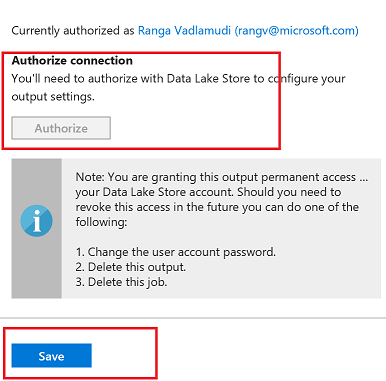

### Edit Stream Analytics Query

Edit Query for Streaming Job, Stream Data from IoTHub to Datalake Store

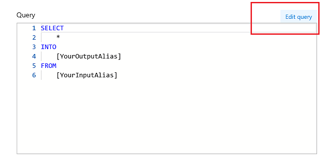

Query

```sql
SELECT
    *, System.Timestamp as time
INTO
    DatalakeStore
FROM
    IotHub
```

Save the query

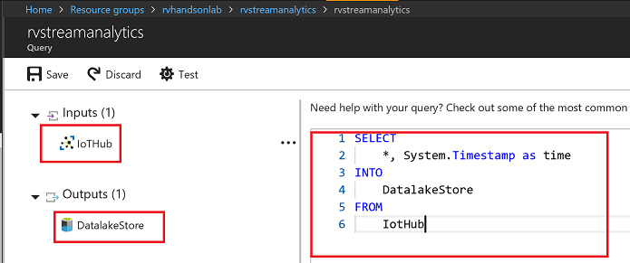

Accept by pressing yes

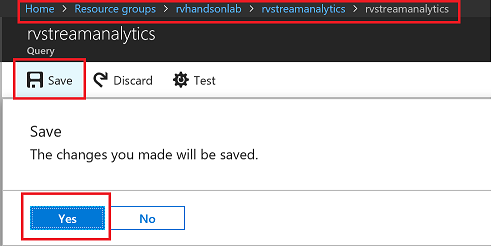

### Start Streaming Analytics Job

Start the stream job which will read data from IoTHub and store data in Data lake Store

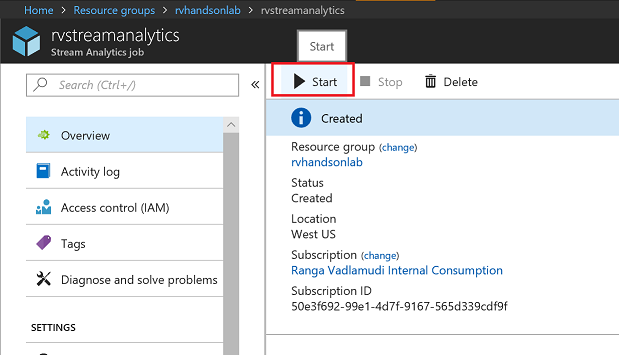

You can pick custom time to go back a few hours to pick up data from when your device has started streaming


Wait till job goes into running state, if you see errors could be from your query, make sure syntax is correct


### Explore Streaming Data

Go to Data Lake store data explorer and drill down to /workshop/streaming folder.You will see folders created with YYYY/MM/DD/HH format. 


You will see json files, with one file per hour, explore the data


