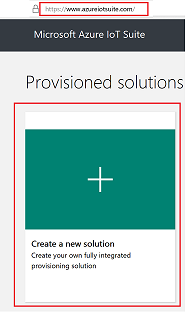
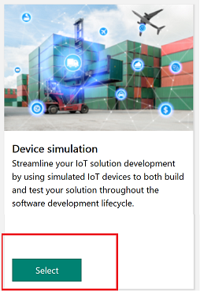
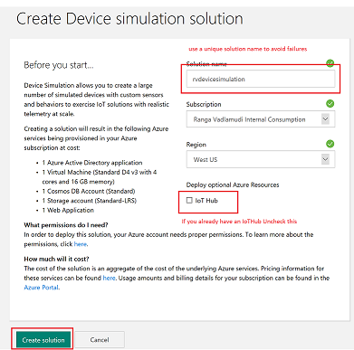
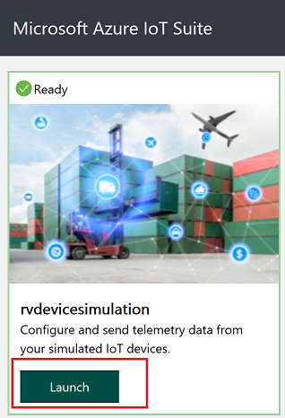
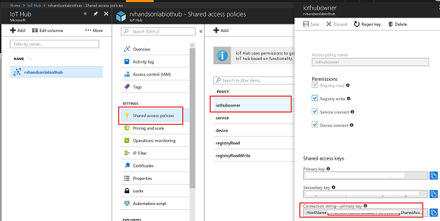
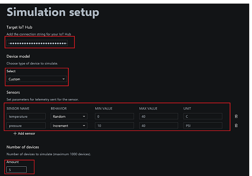
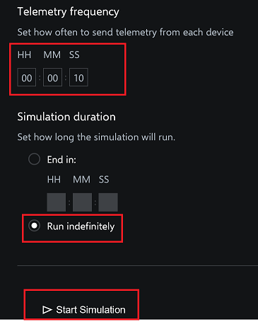
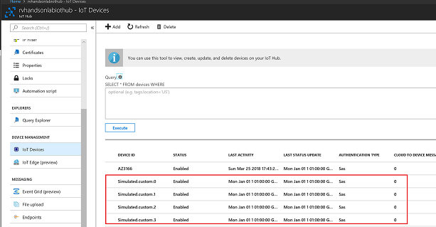

# Load test with Device Simulator

Learn how to set up a Device Simulator using Azure IoT Suite and Connect to IoTHub

## Create Device Simulator

Go To [Azure IoT Suite](https://www.azureiotsuite.com)

Select Device simulation

Create the solution

Launch Device Simulator

## Stream Data to IoTHub

Get connection string of IoT Hub

Setup simulation with sensors and number of devices

Select the frequency of data flowing into IoT Hub 

## New Devices Created in IoTHub

