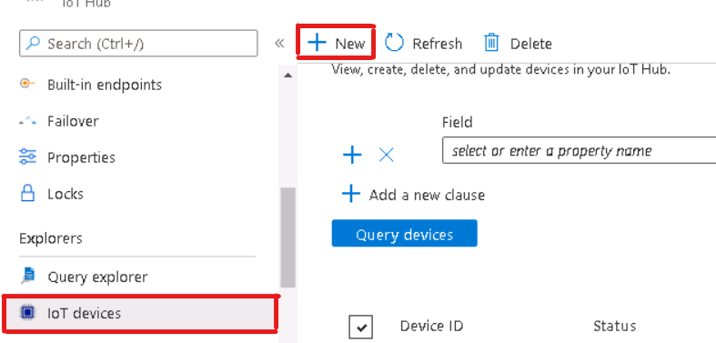
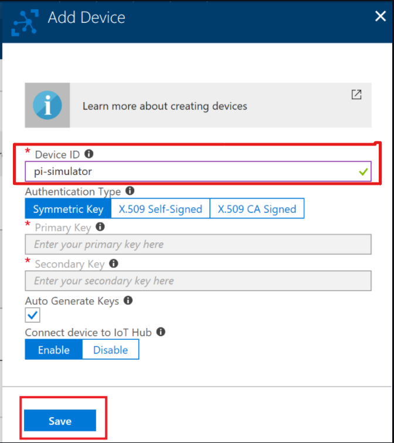
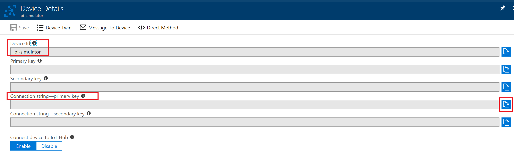
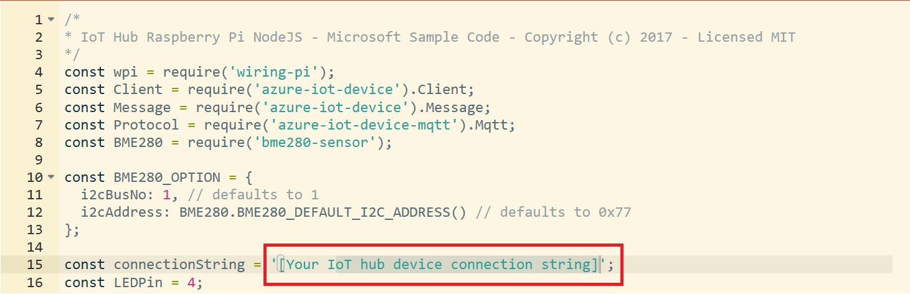
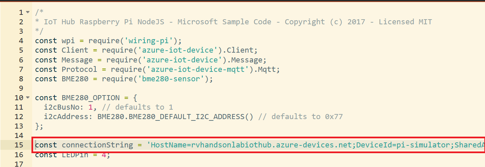
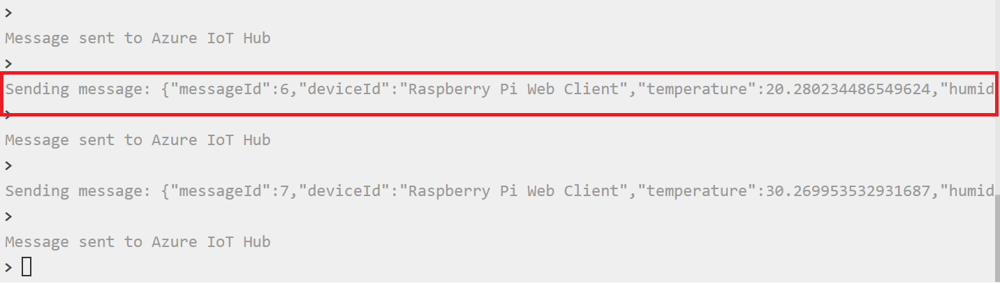
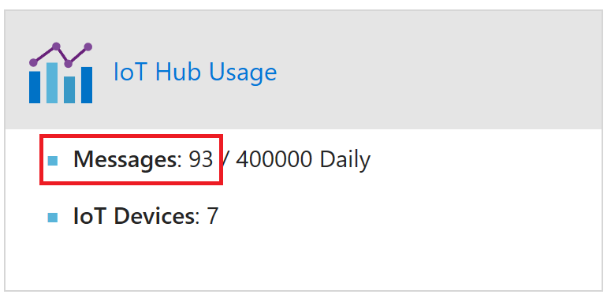

# Connect PI Simulator to IoT Hub

Connect a Simulator to your IoT Hub and stream data. 

### In this lab you will

* Learn to create a device using Azure Portal

* Connect the simulator to IoT Hub

* Send telemetry data to Azure

## Create a Device

* Go To your IoT Hub in the portal and click on **IoT Devices** and  Click on **+ Add**

* Enter a **Device ID** and click **Save**. 

* Click on the device and copy the primary key connection string. 

* Click on the link below to go to the PI Simulator 

[PI Simulator](https://azure-samples.github.io/raspberry-pi-web-simulator/#GetStarted)

* Replace the connection string with the primary key connection string copied in the previous steps

* After you copy the connection string should look like below

* Click Run and start sending messages. LED will start blinking

* Messages will start flowing into IoT Hub

>**You will work with Labs in the Next Module to Visualize the Data flowing into IoT Hub**
