# Exercise 1: Getting Started with Azure 

## Instructions

1. Once the environment is provisioned, a virtual machine (JumpVM) and lab guide will get loaded in your browser. Use this virtual machine throughout the workshop to perform the lab.

2. To get the lab environment details, you can select the **Lab Environment** tab. Additionally, the credentials will also be sent to your email address provided during registration. You will see Deployment ID value on **Lab Environment** tab, use it wherever you see SUFFIX or DeploymentID in lab steps. 

3. You can also open the Lab Guide on Separate full window by selecting the **Arrow** icon on the upper right corner.

## Login to Azure Portal

1. Lets start by logging into the Azure Portal to check the resources deployed for the lab experience. In the JumpVM, click on the Azure portal shortcut of Microsoft Edge browser which is available on the desktop.

2. When you click on Azure portal, the edge browser welcome screen will pop up, select **Get started**.

   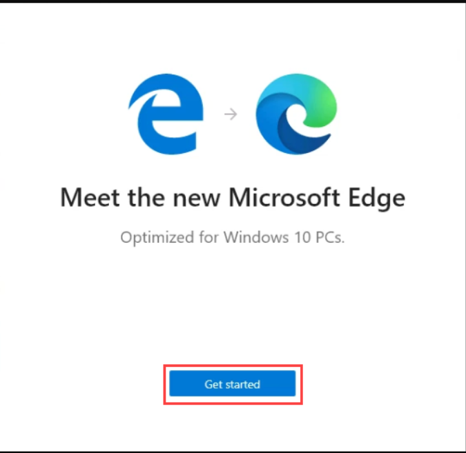
   

3. On the next window, click on **Confirm**.

   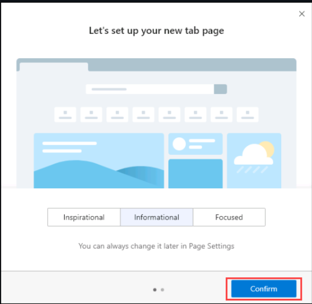

4. You can close the popup which is shown below.

   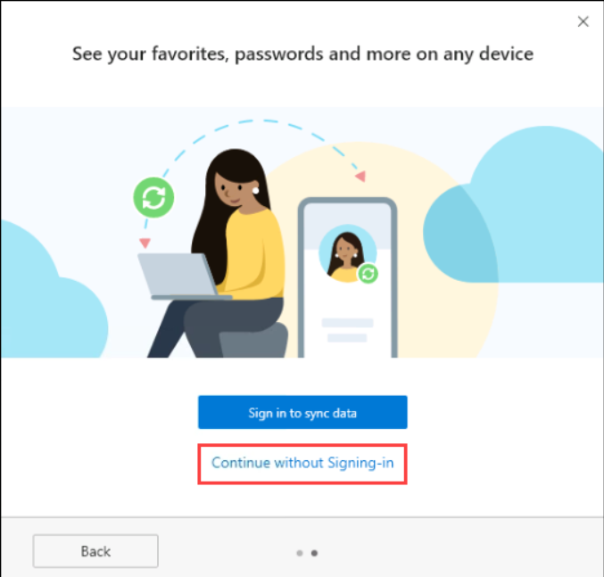

5. Now, you will see two tabs in the edge browser, close the first tab named **Microsoft Edge** to move to the other tab.

   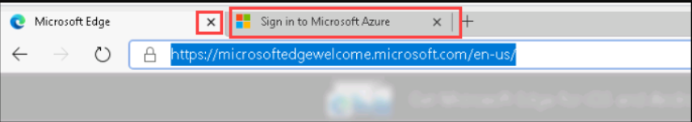

6. On the **Sign into Microsoft Azure** tab, you will see the login screen, enter the username which is provided in the Lab Environment tab and, then click on **Next**.

   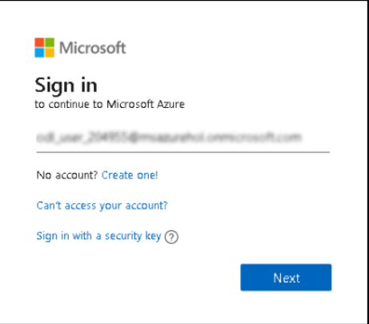

7. Now enter the password which is provided in the Lab Environment tab and click on **Sign in**. 

   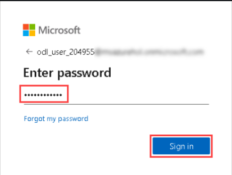

8. If you see the pop-up **Stay Signed in?**, click on No

9. If you see the pop-up **You have free Azure Advisor recommendations!**, close the window to continue the lab.

10. If a **Welcome to Microsoft Azure** popup window appears, click **Maybe Later** to skip the tour.

12. Now you can see Azure Portal Dashboard, click on **Resource groups** to see the resource groups.

   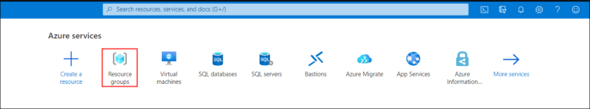

13. Click on the azure-IOT-SUFFIX Resource group and confirm whether you have all the below resources deployed successfully.

   

   * In the Resource group we have one **Virtual Machine**, **IOTHUB**, **Storage account** and **Log Analytics workspace** deployed.
 
 # Introduction to Azure IoT Hub

   
   

Azure IoT Hub is a fully managed service that enables reliable and secure bidirectional communications between millions of IoT devices and a solution back end. Azure IoT Hub:

* Provides multiple device-to-cloud and 
* cloud-to-device communication options. These options include one-way messaging, file transfer, and request-reply methods.
* Provides built-in declarative message routing to other Azure services.
* Provides a queryable store for device metadata and synchronized state information.
* Enables secure communications and access control using per-device security keys or X.509 certificates.
* Provides extensive monitoring for device connectivity and device identity management events.
* Includes device libraries for the most popular languages and platforms.

## IoTHub: Connect, monitor, and manage billions of IoT assets

* **Establish** bi-directional communication with billions of IoT devices
* **Authenticate** per device for security-enhanced IoT solutions
* **Register** devices at scale with IoT Hub Device Provisioning Service
* **Manage** your IoT devices at scale with device management
* **Extend** the power of the cloud to your edge device

### In this lab you will

* Learn to use Simulator to connect to IoT Hub and send Data

* Learn to setup MXChip, connect to IoT Hub and send data

## Connect Device and Send Data to IoThub

This Lab assumes you are using MXChip as the Device

   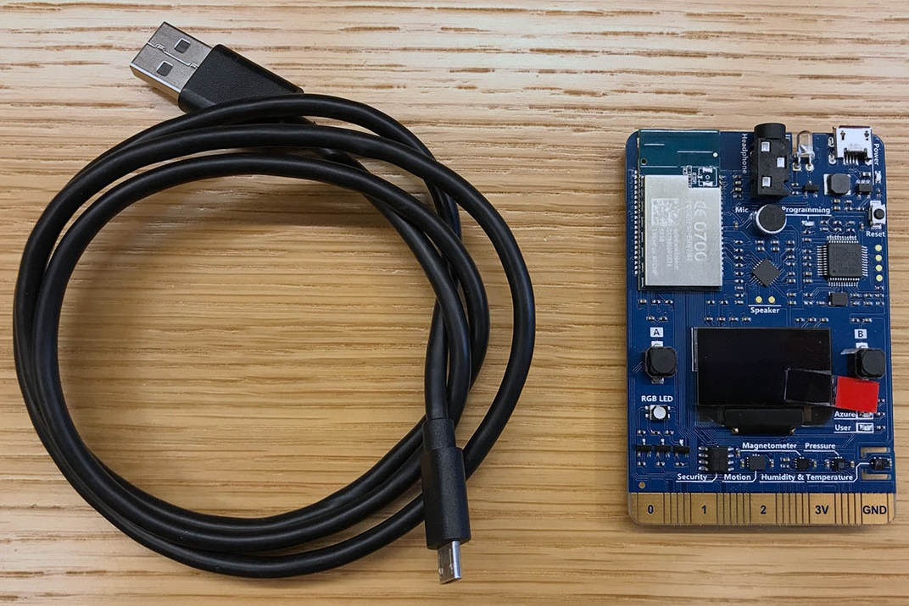

### Prepare the MXChip by 

* updating firmware
* connecting to Wifi
* connecting to Azure to select a subscription and IoTHub
* uploading device code

## Connect IoT DevKit AZ3166 to Azure IoT Hub

* Hook up the following hardware to your computer:

1. DevKit board
2. Micro-USB cable
Once Device Connects to IoTHub, messages flow into IoThub

   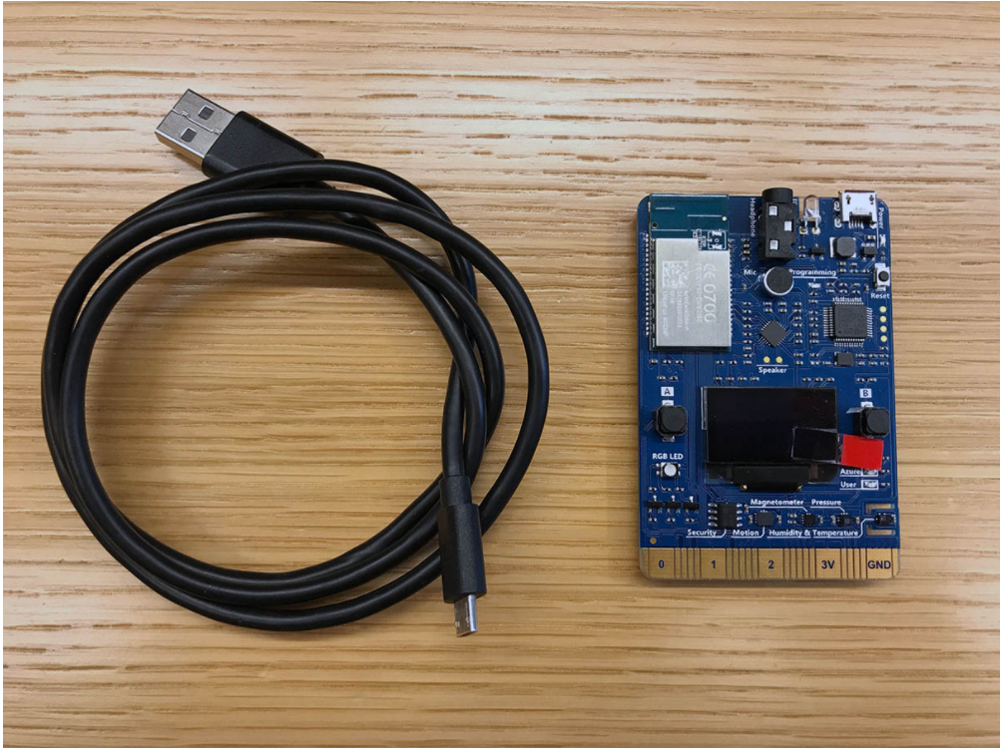

* To connect the DevKit to your computer, follow these steps:

1. Connect the USB end to your computer.
2.Connect the Micro-USB end to the DevKit.
3.The green LED for power confirms the connection.

   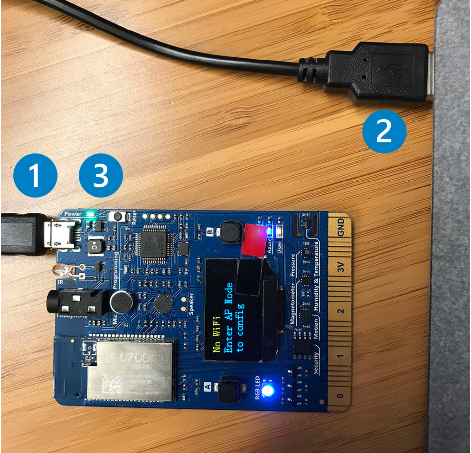


## Register a device
* A device must be registered with your IoT hub before it can connect. In this quickstart, you use the Azure Cloud Shell to register a simulated device.

1. Run the following command in Azure Cloud Shell to create the device identity.

YourIoTHubName: Replace this placeholder below with the name you choose for your IoT hub.

MyNodeDevice: The name of the device you're registering. Use MyNodeDevice as shown. If you choose a different name for your device, you need to use that name throughout this article, and update the device name in the sample applications before you run them.

Azure CLI

```
az iot hub device-identity create --hub-name YourIoTHubName --device-id MyNodeDevice
```
 Note

If you get an error running device-identity, install the Azure IoT Extension for Azure CLI. Run the following command to add the Microsoft Azure IoT Extension for Azure CLI to your Cloud Shell instance. The IoT Extension adds commands that are specific to IoT Hub, IoT Edge, and IoT Device Provisioning Service (DPS) to Azure CLI.

Azure CLI

```
az extension add --name azure-iot
```

2. Run the following commands in Azure Cloud Shell to get the device connection string for the device you just registered:

YourIoTHubName: Replace this placeholder below with the name you choose for your IoT hub.

Azure CLI
```
iot hub device-identity connection-string show --hub-name YourIoTHubName --device-id MyNodeDevice --output table
```
Make a note of the device connection string, which looks like:

HostName={YourIoTHubName}.azure-devices.net;DeviceId=MyNodeDevice;SharedAccessKey={YourSharedAccessKey}

You use this value later in the quickstart.

## Send DevKit telemetry
* The DevKit connects to a device-specific endpoint on your IoT hub and sends temperature and humidity telemetry.

1. Download the latest version of GetStarted firmware for IoT DevKit.
2. Make sure IoT DevKit connect to your computer via USB. Open File Explorer there is a USB mass storage device called AZ3166.

   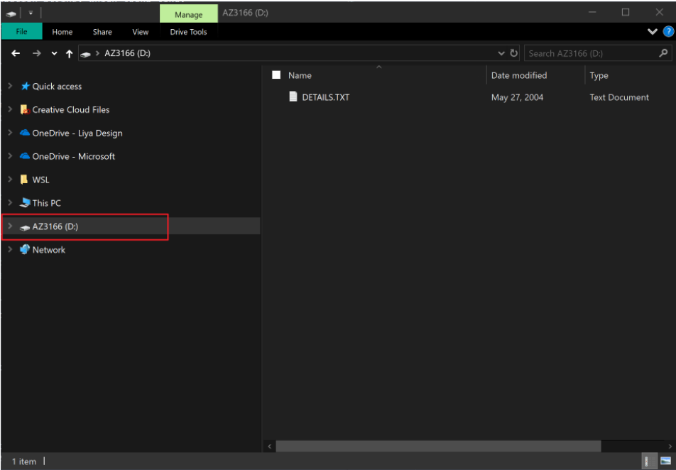

3. Drag and drop the firmware just downloaded into the mass storage device and it will flash automatically.

   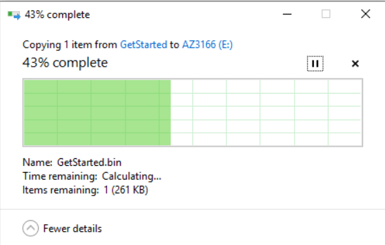


4. On the DevKit, Hold down button B, push and release the Reset button, and then release button B. Your DevKit enters AP mode. To confirm, the screen displays the service set identifier (SSID) of the DevKit and the configuration portal IP address.

   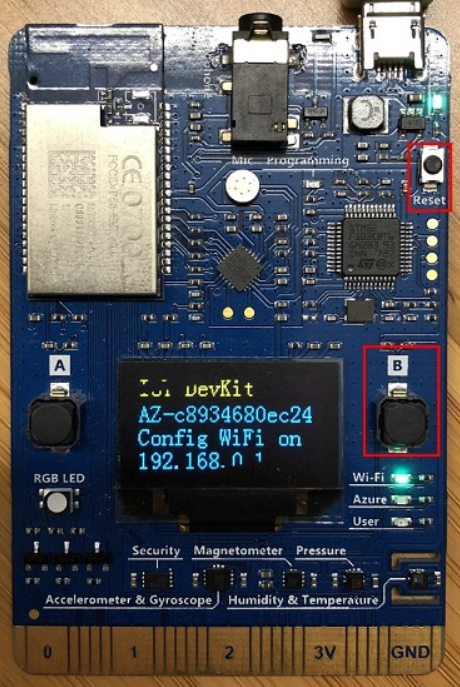


5. Use a Web browser on a different Wi-Fi enabled device (computer or mobile phone) to connect to the IoT DevKit SSID displayed in the previous step. If it asks for a password, leave it empty.

   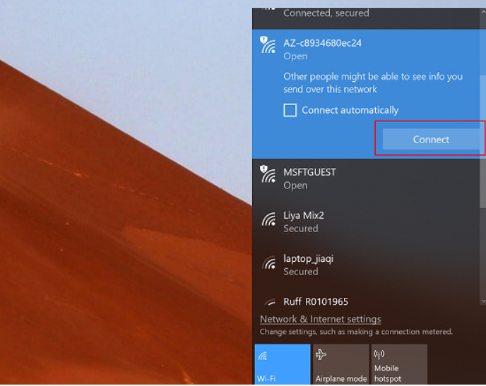


6. Open 192.168.0.1 in the browser. Select the Wi-Fi that you want the IoT DevKit connect to, type the Wi-Fi password, then paste the device connection string you made note of previously. Then click Save.

   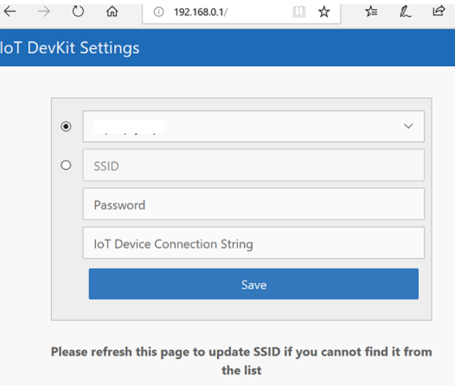

7. The WiFi information and device connection string will be stored into the IoT DevKit when you see the result page.

   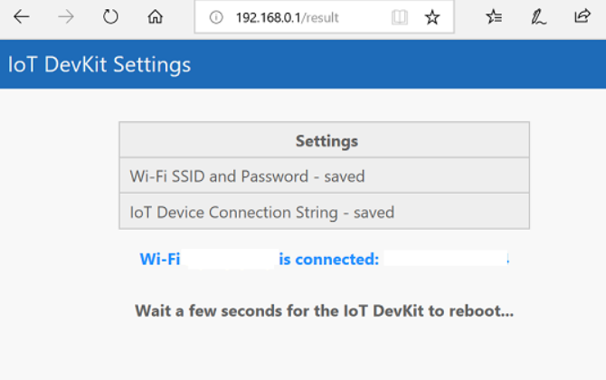

8. The IoT DevKit reboots in a few seconds. On the DevKit screen, you see the IP address for the DevKit follows by the telemetry data including temperature and humidity value with message count send to Azure IoT Hub.

   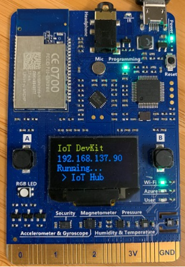
   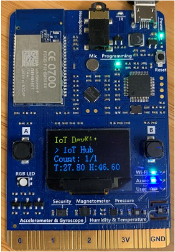


9. To verify the telemetry data sent to Azure, run the following command in Azure Cloud Shell:

Azure CLI
```
az iot hub monitor-events --hub-name YourIoTHubName --output table
```


   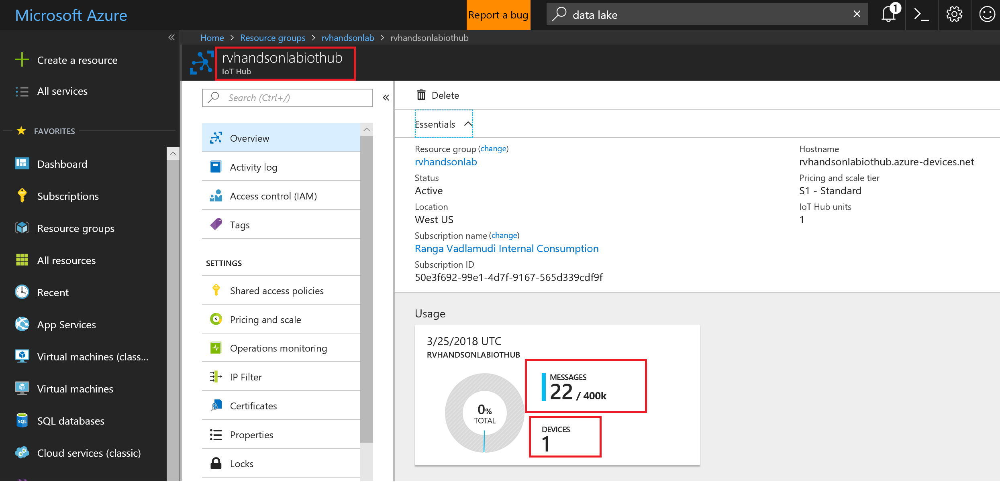
