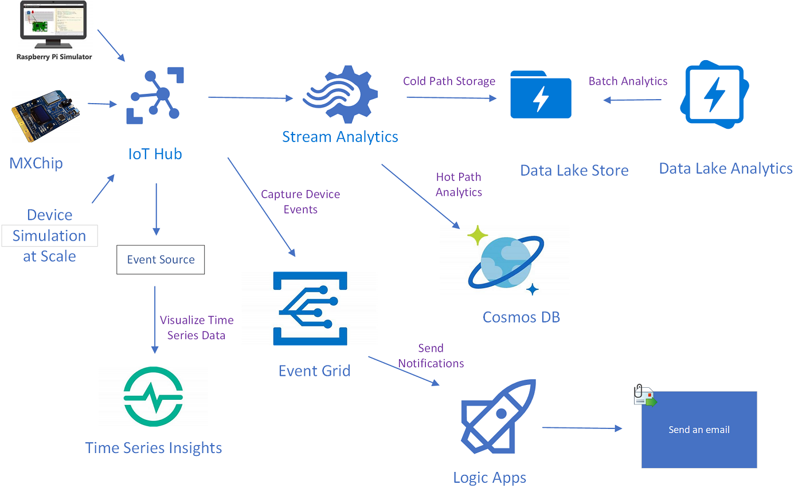

# Azure IoT Hands on Labs

Labs using Azure Services to build Azure IoT End to End Solutions connecting real & simulated devices to Azure IoT Hub.

## Modules

### Module 1: Introduction to Azure IoT Hub and Connect MXChip

**Duration**: 60-90 minutes

[Azure IoTHub Lab with MXChip](/IoTHub/README.md)

### Module 2: Connect Pi Simulator to IoT Hub

**Duration**: 30 minutes

[Azure IoTHub Pi Simulator Lab](/IoTHub-PiSimulator/README.md)

### Module 3: Create Azure Time Series Insights and Visualize Device Data

**Duration**: 60 minutes

[Time Series Insights Lab](/timeseriesinsights/README.md)

### Module 4: Capture Device Events and Send Notifications

**Duration**: 30 minutes

[Azure IoTHub with Event Grid Lab](/EventGrid/README.md)

### Module 5: Cold Path Storage

**Duration**: 60-90 minutes

[Azure Date Lake Store Lab](/DatalakeStore/README.md)

### Module 6: Hot Path Analytics

**Duration**: 60 minutes

[Cosmos DB Lab](/CosmosDB/README.md)

### Module 7: Batch Analytics

**Duration**: 60 minutes

[Azure Date Lake Analytics Lab](/DatalakeAnalytics/README.md)

### Module 8: Load Test using Device Simulator

**Duration**: 30 minutes

[Device Simulator](/DeviceSimulator/README.md)