# Configure and monitor IoT devices at scale


Automatic device management in Azure IoT Hub automates many of the repetitive and complex tasks of managing large device fleets over the entirety of their lifecycles. With automatic device management, you can target a set of devices based on their properties, define a desired configuration, and let IoT Hub update devices whenever they come into scope. This is performed using an automatic device configuration, which will also allow you to summarize completion and compliance, handle merging and conflicts, and roll out configurations in a phased approach.

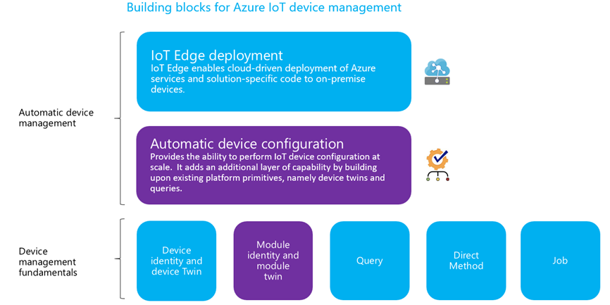

In this lab you will learn how to

* Automate repetitive and complex tasks of managing large device fleets

* In this lab it is assumed that you already have an IoT Hub deployed

## Add New Devices

Add new devices to IoT Hub by clicking on **IoT devices**

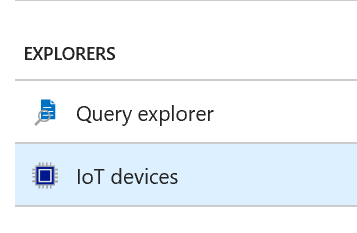

Click on **Add Device** and click **Save**

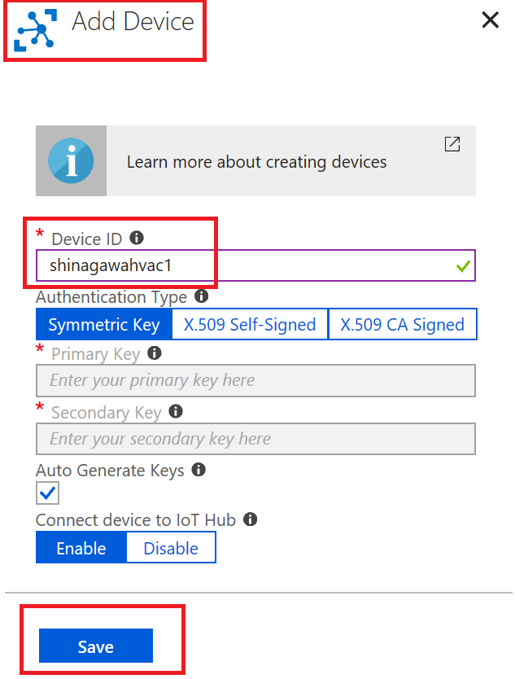

Add two more devices (you can add as many devices you like, in this case devices are prefixed with the city they are installed in, **Shinagawa**)

Add two more devices (you can add as many devices you like, in this case devices are prefixed with the city they are installed in, **Tokyo**)

List of devices you added to IoT Hub are listed below

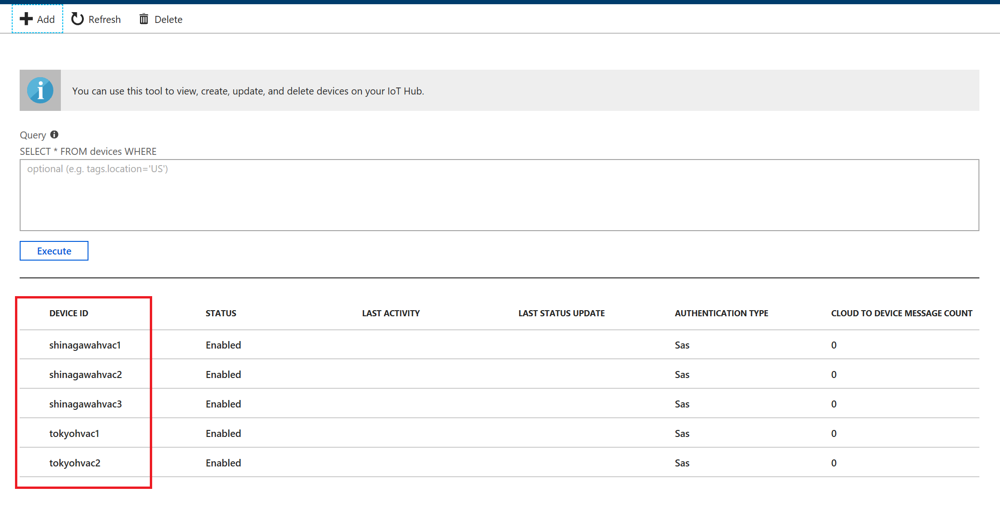

## Add Tags to Devices

Click on each of **Shinagawa** HVAC devices, click on **Device Twin**  and add the following to device twin metadata

```json
"tags": {
  "location": {
    "city": "Shinagawa"
  }
}
```

Click on each of **Tokyo** HVAC devices, click on **Device Twin**  and add the following to device twin metadata

```json
"tags": {
  "location": {
    "city": "Tokyo"
  }
}
```

## Query Devices

Query for **Shinagawa** devices

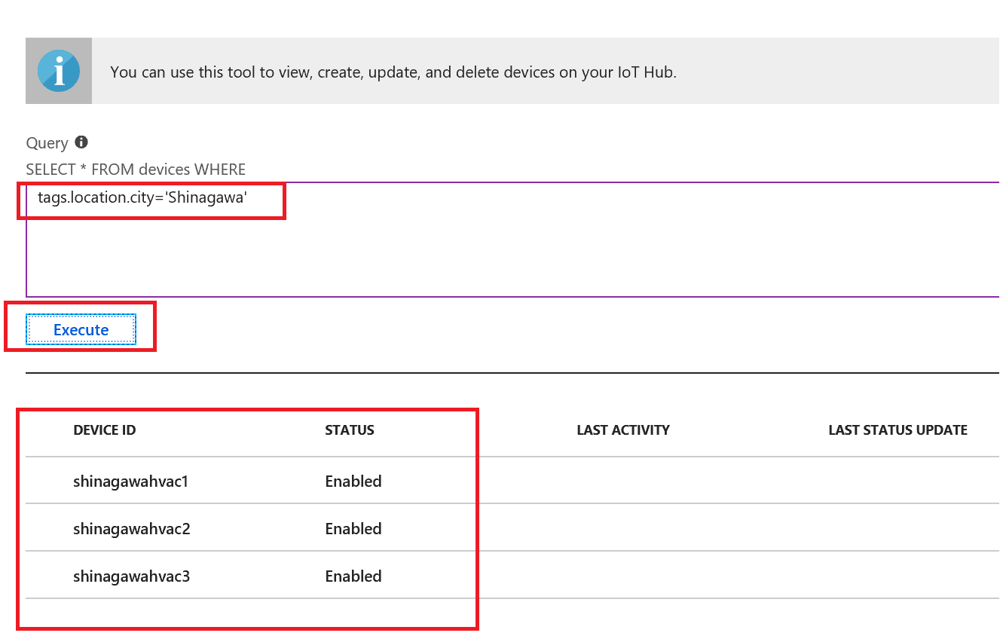

Query for **Tokyo** devices

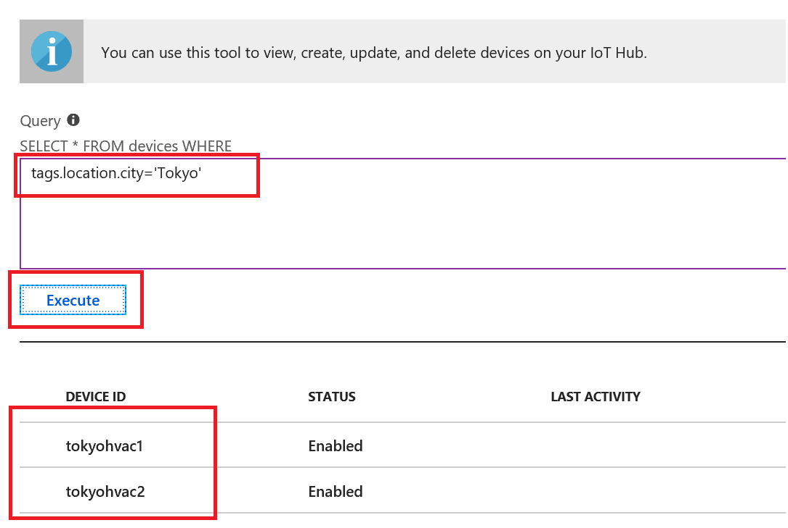

## Create a configuration

There are five steps to create a configuration. The following sections walk through each one.

### Step 1: Name and Label

1. Give your configuration a unique name that is up to 128 lowercase letters. Avoid spaces and the following invalid characters: ```& ^ [ ] { } \ | " < > /.```
2. Add labels to help track your configurations. Labels are Name, Value pairs that describe your configuration. For example, ```Version, 1.0.0.```

3. Select Next to move to step two.

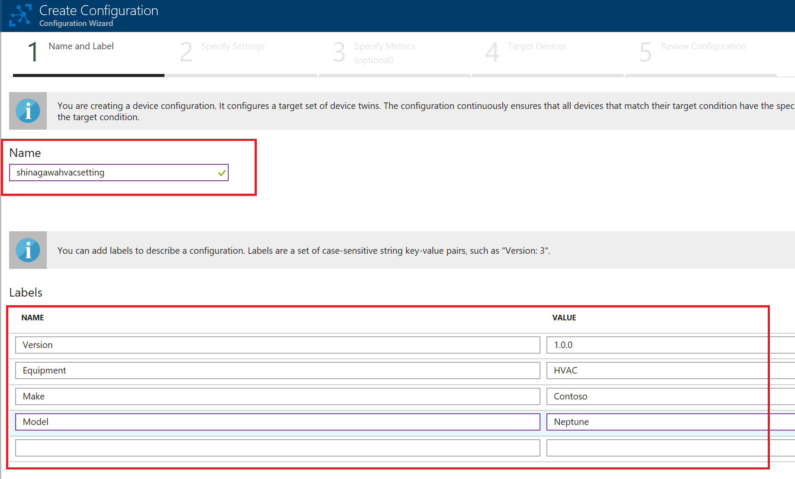

### Step 2: Specify Settings

This section specifies the target content to be set in targeted device twins. There are two inputs for each set of settings.

1. The path to the JSON section within the twin desired properties that will be set. 
2. The second is the JSON content to be inserted in that section.

3. Select Next to move to step three.

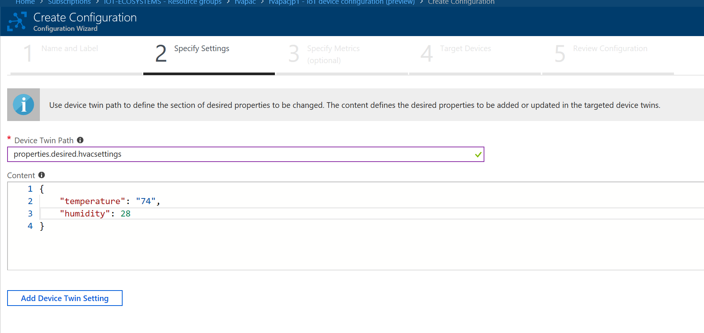

### Step 3: Specify Metrics (Optional)

Metrics provide summary counts of the various states that a device may report back as a result of applying configuration content. 

You may create a metric for pending settings changes, a metric for errors, and a metric for successful settings changes etc.

1. Enter a name for Metric Name
2. Enter a query for Metric Criteria. The query is based on device twin reported properties. The metric represents the number of rows returned by the query.

3. Select Next to move to step four.

```sql
SELECT deviceId FROM devices WHERE properties.reported.hvacsettings.status='pending'}
```

```sql
SELECT deviceId FROM devices WHERE configurations.[[shinagawahvacsetting]].status='Applied' AND properties.reported.hvacsettings.status='Applied'
```

```sql
SELECT deviceId FROM devices WHERE configurations.[[shinagawahvacsetting]].status='Error'
```

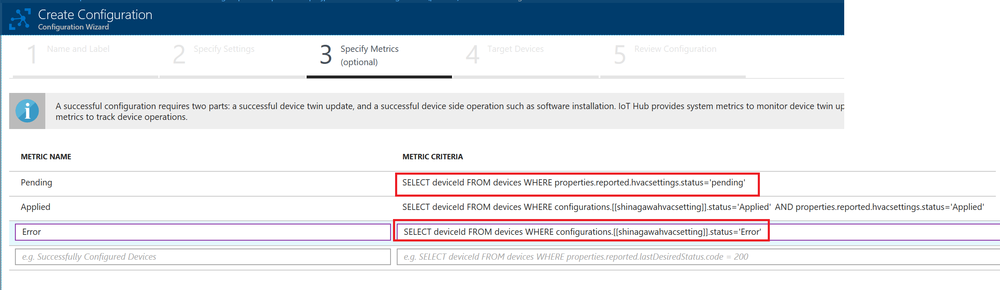

### Step 4: Target Devices

Use the tags property from your device twins to target the specific devices that should receive this configuration. You can also target devices by device twin reported properties.

Since multiple configurations may target the same device, you should give each configuration a priority number. If there's ever a conflict, the configuration with the highest priority wins.

1. Enter a positive integer for the configuration Priority. Highest numerical value is considered the highest priority. If two configurations have the same priority number, the one that was created most recently wins.
2. Enter a Target condition to determine which devices will be targeted with this configuration. The condition is based on device twin tags or device twin reported properties.

3. Select Next to move to step five.

Select Next to move on to the final step.
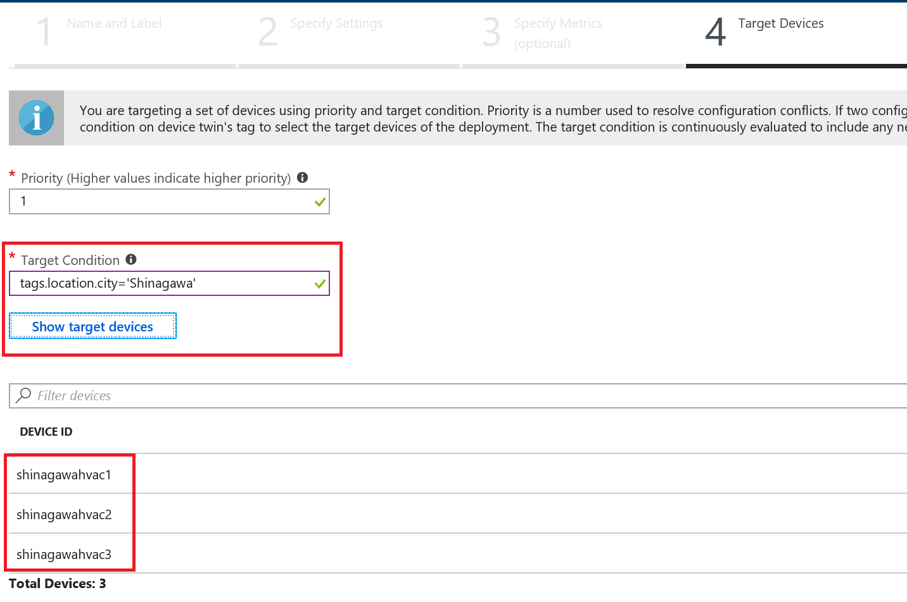

### Step 4: Review Configuration

Review your configuration information, then select **Submit**.

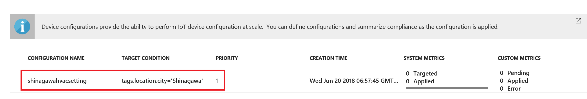

Results of applied changes


Check device twin to see the configuration updates. Go to **IoT Devices**, click on **shinagawahvac1** and click on **device twin**. Similarly check all devices located in **Shinagawa**


Below is the device twin updated with properties

```json
{
  "deviceId": "shinagawahvac1",
  "etag": "AAAAAAAAAAU=",
  "deviceEtag": "OTc4NTUyNjk1",
  "status": "enabled",
  "statusUpdateTime": "0001-01-01T00:00:00",
  "connectionState": "Disconnected",
  "lastActivityTime": "0001-01-01T00:00:00",
  "cloudToDeviceMessageCount": 0,
  "authenticationType": "sas",
  "x509Thumbprint": {
    "primaryThumbprint": null,
    "secondaryThumbprint": null
  },
  "version": 6,
  "tags": {
    "location": {
      "city": "Shinagawa"
    }
  },
  "properties": {
    "desired": {
      "hvacsettings": {
        "temperature": "74",
        "humidity": 28
      },
      "$metadata": {
        "$lastUpdated": "2018-06-19T21:57:51.8460184Z",
        "$lastUpdatedVersion": 4,
        "hvacsettings": {
          "$lastUpdated": "2018-06-19T21:57:51.8460184Z",
          "$lastUpdatedVersion": 4,
          "temperature": {
            "$lastUpdated": "2018-06-19T21:57:51.8460184Z",
            "$lastUpdatedVersion": 4
          },
          "humidity": {
            "$lastUpdated": "2018-06-19T21:57:51.8460184Z",
            "$lastUpdatedVersion": 4
          }
        }
      },
      "$version": 4
    },
    "reported": {
      "$metadata": {
        "$lastUpdated": "2018-06-19T21:34:38.2330387Z"
      },
      "$version": 1
    }
  },
  "configurations": {
    "shinagawahvacsetting": {
      "status": "Applied"
    }
  }
}
```
